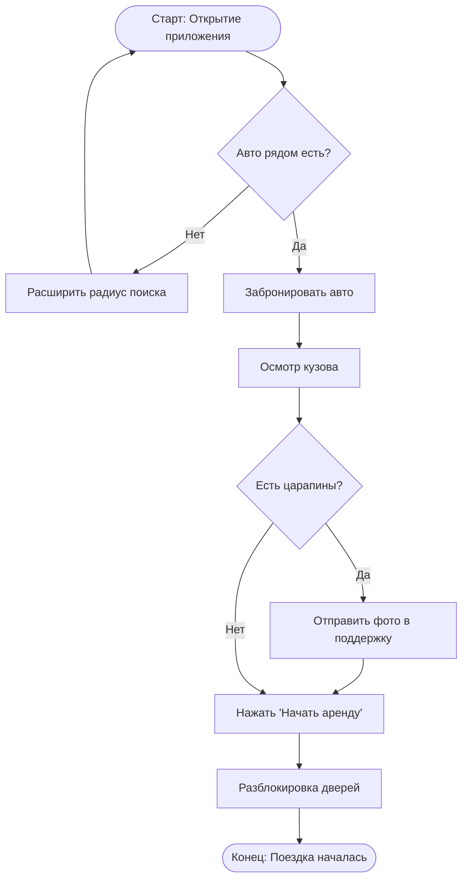

```mermaid
flowchart TD
    Start([Старт: Открытие приложения]) --> CheckCars{Авто рядом есть?}
    CheckCars -- Нет --> SearchMore[Расширить радиус поиска] --> Start
    CheckCars -- Да --> Book[Забронировать авто]
    Book --> Inspect[Осмотр кузова]
    Inspect --> CheckDamage{Есть царапины?}
    CheckDamage -- Да --> SendPhoto[Отправить фото в поддержку] --> Unlock
    CheckDamage -- Нет --> Unlock[Нажать 'Начать аренду']
    Unlock --> OpenDoors[Разблокировка дверей]
    OpenDoors --> Finish([Конец: Поездка началась])
```